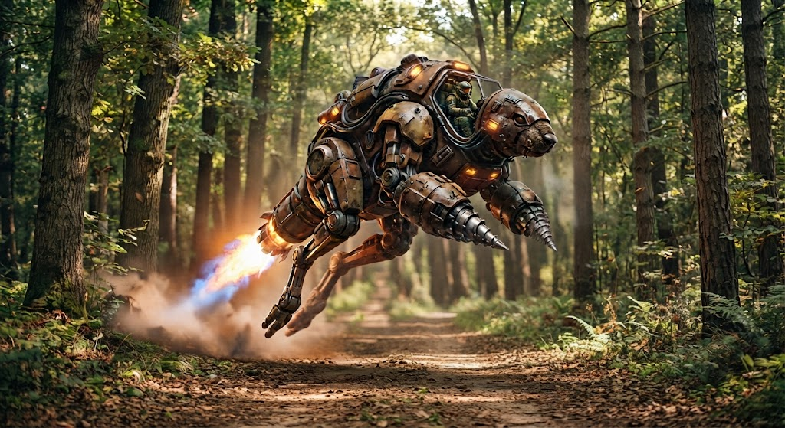

# ТЗ: Терра-Хоппер
Автор: Сурнин Дмитрий Сергеевич

Стихия: Земля

Проект: Земляной Кенгуру-Крот «Терра-Хоппер»

Репозиторий: https://github.com/SurninDmitri/crazy-transport

Дата заморозки: <дата>

Версия: <0.1>

# 1. Назначение
Земляной Кенгуру-Крот «Терра-Хоппер» — гибридное средство передвижения, сочетающее упругую кинетику прыжков с реактивным ускорением и подземным бурением.
Предназначен для преодоления пересеченной местности и лесных троп прыжками разной дальности.
Способен мгновенно погружаться под землю с помощью мощных носовых буров.



# 2. Стихия и конструкционный элемент

Стихия: Земля

- Конструкционные элементы:
    - Реактор, добавляющий энергию и скорость к далнему прыжку
    - Носовой бур, позволяющий погружаться под землю
- Ограничения стихии:
    - Способен передвигаться снаружи только прыжками разной мощности (видами прыжков)
    - Под землёй способен преодолевать не более фиксированного расстояния с помощью рывков

# 3. Публичный интерфейс

### 3.1. Класс
- class: TerraHopper
- Модуль: terra_hopper.py

### 3.2. Конструктор
```python
def __init__(
    self,
    name: str,
    mass_kg: float,
    strength: float = 100.0,
    reactor_energy: float = 100.0,
) -> None:
```
| Параметр       | Тип   | Единица              | Допустимый диапазон | Значение по умолчанию | Описание                          |
|----------------|-------|----------------------|---------------------|-----------------------|-----------------------------------|
| name           | str   | —                    | непустая строка     | —                     | Уникальное имя транспорта.        |
| mass_kg        | float | кг                   | 100.0 … 500.0       | —                     | Масса транспорта.                 |
| strength       | float | условные единицы (%) | 0 … 100             | 100.0                 | Начальный запас силы механических узлов. |
| reactor_energy | float | условные единицы (%) | 0 … 100             | 100.0                 | Начальный запас энергии реактора. |

**Исключения конструктора:**
- ValueError — если name пустой или состоит только из пробелов. **Текст ошибки:** "Имя не может быть пустым."
- ValueError — если mass_kg вне диапазона 100.0…500.0. **Текст ошибки:** "Масса должна быть в диапазоне 100.0…500.0 кг."
- ValueError — если strength вне диапазона 0…100. **Текст ошибки:** "Сила должна быть в диапазоне 0…100."
- ValueError — если reactor_energy вне диапазона 0…100. **Текст ошибки:** "Энергия реактора должна быть в диапазоне 0…100."

### 3.3. Атрибуты
| Атрибут        | Тип   | Единица              | Доступ | Описание                                          |
|----------------|-------|----------------------|--------|---------------------------------------------------|
| name           | str   | —                    | чтение | Имя транспорта                                    |
| mass_kg        | float | кг                   | чтение | Масса транспорта                                  |
| strength       | float | условные единицы (%) | чтение | Текущий запас силы и прочности                    |
| reactor_energy | float | условные единицы (%) | чтение | Текущий запас энергии реактора                    |
| location_state | str   | —                    | чтение | Текущее положение («surface» или «underground»)   |
| distance       | float | метры                | чтение | Общее пройденное расстояние                       |

### 3.4. Методы

#### 3.4.1. basic_jump
```python
def basic_jump(self) -> None:
```
**Назначение:** Совершает стандартный низкозатратный прыжок по поверхности земли.

**Параметры:** Отсутствуют (кроме self).

**Изменяет:** 
  - distance
  - strength


**Исключения:**

InvalidLocationError

  - **Условие:** транспорт находится под землей (location_state == "underground").

  - **Текст ошибки:** "Прыжок невозможен: транспорт находится под землей."

NotEnoughStrengthError

  - **Условие:** текущий запас силы (strength) меньше, чем требуется для прыжка с учетом массы ( 3.0 + (self.mass_kg / 100) )

  - **Текст ошибки:** "Не достаточно силы для выполнения обычного прыжка."

**Правила:**
  - Доступно для выполнения только на поверхности (location_state == "surface").

  - Увеличивает distance на фиксированное значение короткого прыжка (на 10.0 метров)

  - Уменьшает запас силы (strength) на фиксированную величину ( 3.0 + (self.mass_kg / 100) ).

  - Энергия реактора (reactor_energy) не расходуется и остается неизменной.

#### 3.4.2. long_jump
```python
def long_jump(self, use_reactor: bool = False) -> None:
```
**Назначение:** Совершает дальний прыжок на поверхности земли с возможностью форсажа с помощью реактора.

**Параметры:** use_reactor — флаг использования реактивного ускорителя (тип bool, по умолчанию False).

**Изменяет:**
  - distance
  - strength
  - reactor_energy (только если use_reactor == True)

**Исключения:**

InvalidLocationError

  - **Условие:** транспорт находится под землей (location_state == "underground").

  - **Текст ошибки:** "Дальний прыжок невозможен: транспорт находится под землей."

NotEnoughStrengthError

  - **Условие:** текущий запас силы (strength) меньше, чем требуется для прыжка с учетом массы (10.0 + (self.mass_kg / 100.0) * 2.0).

  - **Текст ошибки:** "Недостаточно силы для выполнения дальнего прыжка."

NotEnoughEnergyError

  - **Условие:** передан аргумент use_reactor=True, но текущий запас энергии реактора (reactor_energy) меньше 50.0 единиц.

  - **Текст ошибки:** "Недостаточно энергии реактора для форсажа (требуется 50.0)."

**Правила:**
  - Доступно для выполнения только на поверхности (location_state == "surface").

  - Уменьшает запас силы (strength) по формуле: 10.0 + (mass_kg / 100.0) * 2.0.

  - Если use_reactor == False:
    - Увеличивает distance на базовые 30.0 метров.
    - Энергия реактора (reactor_energy) не расходуется.

  - Если use_reactor == True:
    - Увеличивает distance на 45.0 метров (базовые 30.0 метров плюс 50%).
    - Уменьшает reactor_energy на 50.0 единиц (50% от максимального заряда).

### 3.4.3. _apply_distance_recovery
```python
def _apply_distance_recovery(self) -> None:
```
**Назначение:** Проверяет достижение контрольных отметок дистанции (каждые 100 метров) и выполняет пассивное восстановление силы транспорта и энергии реактора с учетом массы.

**Параметры:** Отсутствуют (кроме self).

**Изменяет:**
  - strength
  - reactor_energy

**Исключения:** Отсутствуют.

**Правила:**
  - Срабатывает автоматически при пересечении каждой новой отметки в 100 метров общей дистанции (distance).

  - Увеличивает запас силы (strength) по формуле: 45.0 - (self.mass_kg / 10) * 0.5 

  - Увеличивает энергию реактора (reactor_energy) по аналогичной формуле: 45.0 - (self.mass_kg / 10) * 0.5.

  -  Значения strength и reactor_energy не могут превышать максимальное значение в 100.0 единиц.

#### 3.4.4. get_current_status
```python
def get_current_status(self) -> dict:
```
**Назначение:** Выводит текущее состояние транспорта в консоль и возвращает словарь с ключевыми характеристиками для последующей валидации или интеграции с Pydantic.

**Параметры:** Отсутствуют (кроме self).

**Изменяет:** Отсутствуют (метод работает только на чтение).

**Исключения:** Отсутствуют.

**Правила:**
  - Формирует словарь с текущими значениями distance, strength и reactor_energy.
  - Выводит её в консоль с помощью print().
  - Возвращает словарь с ключами "distance", "strength" и "reactor_energy", содержащими актуальные числовые значения (float).

#### 3.4.5. go_underground
```python
def go_underground(self) -> None:
```
**Назначение:** Переводит транспорт в подземный режим работы (погружение под землю).

**Параметры:** Отсутствуют (кроме self).

**Изменяет:**
  - location_state (меняет значение с "surface" на "underground")
  - strength

**Исключения:**

InvalidLocationError

  - **Условие:** транспорт уже находится под землей (location_state == "underground").

  - **Текст ошибки:** "Транспорт уже находится под землей."

NotEnoughStrengthError

  - **Условие:** текущий запас силы (strength) меньше, чем требуется для погружения (3.0 * (self.mass_kg / 100.0)).

  - **Текст ошибки:** "Недостаточно силы для погружения под землю."

**Правила:**
  - Доступно для выполнения только с поверхности (location_state == "surface").

  - Уменьшает запас силы (strength) по формуле: 3.0 * (self.mass_kg / 100.0) 

  - Дистанция (distance) и энергия реактора (reactor_energy) остаются неизменными.

  - Успешно меняет состояние локации на "underground".

#### 3.4.6. return_to_surface
```python
def return_to_surface(self) -> None:
```
**Назначение:** Возвращает транспорт обратно на поверхность земли из подземного режима.

**Параметры:** Отсутствуют (кроме self).

**Изменяет:**
  - location_state (меняет значение с "underground" на "surface")
  - strength

**Исключения:**

InvalidLocationError

  - **Условие:** транспорт уже находится на поверхности (location_state == "surface").

  - **Текст ошибки:** "Транспорт уже находится на поверхности."

NotEnoughStrengthError

  - **Условие:** текущий запас силы (strength) меньше, чем требуется для подъема (3.0 * (self.mass_kg / 100.0)).

  - **Текст ошибки:** "Недостаточно силы для возвращения на поверхность."

**Правила:**
  - Доступно для выполнения только из подземелья (location_state == "underground").

  - Уменьшает запас силы (strength) по формуле: 3.0 * (self.mass_kg / 100.0).

  - Дистанция (distance) и энергия реактора (reactor_energy) остаются неизменными.

  - Успешно меняет состояние локации на "surface".

#### 3.4.7. drill_forward
```python
def drill_forward(self) -> None:
```
**Назначение:** Выполняет подземный рывок (бурение) вперед, преодолевая 40 метров пути

**Параметры:** Отсутствуют (кроме self).

**Изменяет:**
  - distance
  - strength
  - reactor_energy

**Исключения:**

InvalidLocationError

  - **Условие:** транспорт находится на поверхности (location_state == "surface").

  - **Текст ошибки:** "Подземное бурение невозможно на поверхности. Сначала погрузитесь."

NotEnoughStrengthError

  - **Условие:** текущий запас силы (strength) меньше, чем требуется для бурения (10.0 + (self.mass_kg / 100.0) * 3.0).

  - **Текст ошибки:** "Недостаточно силы для подземного бурения."

NotEnoughEnergyError

  - **Условие:** текущая энергия реактора (reactor_energy) меньше 50.0 единиц.

  - **Текст ошибки:** "Недостаточно энергии реактора для запуска буров (требуется 50.0)."

**Правила:**
  - Доступно для выполнения только под землей (location_state == "underground").

  - Увеличивает общую дистанцию (distance) ровно на 40.0 метров.

  - Уменьшает запас силы (strength) по формуле: 10.0 + (self.mass_kg / 100.0) * 3.0 .

  -  Расходует 50.0 единиц энергии реактора (reactor_energy)

  - Автоматически проверяет и вызывает метод пассивного восстановления (_apply_distance_recovery), если общая дистанция перешагнула очередную отметку в 100 метров.

# 4. Модель водителя (Менеджер транспорта с защитой состояния)

### 4.1. Класс и назначение

- Класс: Driver
- Модуль: driver.py
- Тип модели: Контроллер-менеджер. Управляет жизненным циклом и командами транспорта через внутреннюю ссылку.

### 4.2. Конструктор и атрибуты

Конструктор __init__:
  - Создает объект водителя без привязанного транспорта.
  - Атрибут terra_hopper инициализируется со значением None.

### 4.3. Управляющие методы

#### 4.3.1. create_hopper (Создание транспорта)
**Назначение:** Создает экземпляр TerraHopper и привязывает его к текущему водителю.

**Параметры:** name, mass_kg, strength (опционально), reactor_energy (опционально).

**Поведение:** Инициализирует объект транспорта и сохраняет его в self.terra_hopper.

#### 4.3.2. Методы-действия (basic_jump, long_jump, go_underground, return_to_surface, drill_forward)
**Назначение:** Делегируют команды физического перемещения и изменения состояния управляемому транспорту.

**Общее правило:**
  - **Проверка:** Если self.terra_hopper is None, метод должен выбросить исключение NoTransportError с текстом: "Транспорт не выбран. Сначала создайте транспорт!"

  - Если транспорт существует, метод вызывает соответствующий метод у self.terra_hopper и возвращает None.

#### 4.3.3. Методы-запросы (get_current_status)
**Назначение:** Запрашивают и возвращают актуальные данные от управляемого транспорта.

**Общее правило:**
  - **Проверка:** Если self.terra_hopper is None, метод должен выбросить исключение NoTransportError с текстом: "Транспорт не выбран. Сначала создайте транспорт!"

  - Если транспорт существует, метод вызывает соответствующий метод у self.terra_hopper и возвращает полученный результат пользователю.

# 5. Сценарии

## 5.1 Модульные тесты

Каждый тест следует шаблону **AAA (Arrange – Act – Assert)**:

1. **Arrange** — атрибуты, с которыми создается объект (значения по умолчанию не перечисляются).
2. **Act** — одно целевое действие (конструктор или метод).
3. **Assert** — ожидаемые значения атрибутов либо исключение и его текст.


### 5.1.1. Позитивные сценарии

#### Конструктор TerraHopper

##### Сценарий 1. Инициализация с параметрами по умолчанию

* **Arrange:** name="Крот-1", mass_kg=200.0
* **Act:** `TerraHopper(name, mass_kg)`
* **Assert:** `name == "Крот-1"`, `mass_kg == 200.0`, `strength == 100.0`, `reactor_energy == 100.0`, `location_state == "surface"`, `distance == 0.0`

##### Сценарий 2. Инициализация со всеми параметрами

* **Arrange:** name="Крот-1", mass_kg=350.0, strength=80.0, reactor_energy=60.0
* **Act:** `TerraHopper(name, mass_kg, strength, reactor_energy)`
* **Assert:** `name == "Крот-1"`, `mass_kg == 350.0`, `strength == 80.0`, `reactor_energy == 60.0`, `location_state == "surface"`, `distance == 0.0`

```python
basic_jump
```

##### Сценарий 3. Успешный прыжок с поверхности

* **Arrange:** name="Крот-1", mass_kg=200.0, strength=100.0, reactor_energy=100.0, location_state="surface", distance=0.0
* **Act:** `basic_jump()`
* **Assert:** `distance == 10.0`, `strength == 95.0`, `reactor_energy == 100.0`, `location_state == "surface"`

##### Сценарий 4. Сила ровно равна требуемой (5.0)

* **Arrange:** name="Крот-1", mass_kg=200.0, strength=5.0, location_state="surface", distance=0.0
* **Act:** `basic_jump()`
* **Assert:** `distance == 10.0`, `strength == 0.0`, `location_state == "surface"`

```python
long_jump
```

##### Сценарий 5. Успешный прыжок без реактора

* **Arrange:** name="Крот-1", mass_kg=200.0, strength=100.0, reactor_energy=100.0, location_state="surface", distance=0.0
* **Act:** `long_jump(use_reactor=False)`
* **Assert:** `distance == 30.0`, `strength == 86.0`, `reactor_energy == 100.0`

##### Сценарий 6. Успешный прыжок с форсажем

* **Arrange:** name="Крот-1", mass_kg=200.0, strength=100.0, reactor_energy=100.0, location_state="surface", distance=0.0
* **Act:** `long_jump(use_reactor=True)`
* **Assert:** `distance == 45.0`, `strength == 86.0`, `reactor_energy == 50.0`

##### Сценарий 7. Энергия реактора ровно 50.0 при форсаже

* **Arrange:** name="Крот-1", mass_kg=200.0, strength=100.0, reactor_energy=50.0, location_state="surface", distance=0.0
* **Act:** `long_jump(use_reactor=True)`
* **Assert:** `distance == 45.0`, `strength == 86.0`, `reactor_energy == 0.0`

```python
_apply_distance_recovery
```

##### Сценарий 8. Восстановление при пересечении отметки 100 м

* **Arrange:** name="Крот-1", mass_kg=200.0, strength=50.0, reactor_energy=50.0, distance=100.0
* **Act:** `_apply_distance_recovery()`
* **Assert:** `distance == 100.0`, `strength == 85.0`, `reactor_energy == 85.0`

##### Сценарий 9. Ограничение восстановления значением 100.0

* **Arrange:** name="Крот-1", mass_kg=200.0, strength=90.0, reactor_energy=95.0, distance=100.0
* **Act:** `_apply_distance_recovery()`
* **Assert:** `distance == 100.0`, `strength == 100.0`, `reactor_energy == 100.0`

```python
get_current_status
```

##### Сценарий 10. Возврат словаря состояния

* **Arrange:** name="Крот-1", mass_kg=200.0, strength=80.0, reactor_energy=90.0, location_state="surface", distance=20.0
* **Act:** `get_current_status()`
* **Assert:** возвращается `{"distance": 20.0, "strength": 80.0, "reactor_energy": 90.0}`; `distance == 20.0`, `strength == 80.0`, `reactor_energy == 90.0`

```python
go_underground
```

##### Сценарий 11. Успешное погружение с поверхности

* **Arrange:** name="Крот-1", mass_kg=200.0, strength=100.0, reactor_energy=100.0, location_state="surface", distance=0.0
* **Act:** `go_underground()`
* **Assert:** `location_state == "underground"`, `strength == 94.0`, `distance == 0.0`, `reactor_energy == 100.0`

```python
return_to_surface
```

##### Сценарий 12. Успешный подъем из подземелья

* **Arrange:** name="Крот-1", mass_kg=200.0, strength=100.0, reactor_energy=100.0, location_state="underground", distance=0.0
* **Act:** `return_to_surface()`
* **Assert:** `location_state == "surface"`, `strength == 94.0`, `distance == 0.0`, `reactor_energy == 100.0`

```python
drill_forward
```

##### Сценарий 13. Успешный подземный рывок

* **Arrange:** name="Крот-1", mass_kg=200.0, strength=100.0, reactor_energy=100.0, location_state="underground", distance=0.0
* **Act:** `drill_forward()`
* **Assert:** `distance == 40.0`, `strength == 84.0`, `reactor_energy == 50.0`

#### Driver

##### Сценарий 14. Инициализация водителя без транспорта

* **Arrange:** —
* **Act:** `Driver()`
* **Assert:** `terra_hopper is None`

##### Сценарий 15. Создание транспорта с параметрами по умолчанию

* **Arrange:** name="Крот-1", mass_kg=200.0
* **Act:** `driver.create_hopper(name, mass_kg)`
* **Assert:** `driver.terra_hopper` — экземпляр `TerraHopper`; `name == "Крот-1"`, `strength == 100.0`, `reactor_energy == 100.0`

##### Сценарий 16. Создание транспорта со всеми параметрами

* **Arrange:** name="Крот-1", mass_kg=350.0, strength=80.0, reactor_energy=60.0
* **Act:** `driver.create_hopper(name, mass_kg, strength, reactor_energy)`
* **Assert:** `mass_kg == 350.0`, `strength == 80.0`, `reactor_energy == 60.0`

##### Сценарий 17. Делегирование `basic_jump`

* **Arrange:** name="Крот-1", mass_kg=200.0, strength=100.0, location_state="surface", distance=0.0
* **Act:** `driver.basic_jump()`
* **Assert:** `distance == 10.0`, `strength == 95.0`

##### Сценарий 18. Делегирование `long_jump` с форсажем

* **Arrange:** name="Крот-1", mass_kg=200.0, strength=100.0, reactor_energy=100.0, location_state="surface", distance=0.0
* **Act:** `driver.long_jump(use_reactor=True)`
* **Assert:** `distance == 45.0`, `strength == 86.0`, `reactor_energy == 50.0`

##### Сценарий 19. Делегирование `drill_forward`

* **Arrange:** name="Крот-1", mass_kg=200.0, strength=100.0, reactor_energy=100.0, location_state="underground", distance=0.0
* **Act:** `driver.drill_forward()`
* **Assert:** `distance == 40.0`, `strength == 84.0`, `reactor_energy == 50.0`

##### Сценарий 20. Делегирование `get_current_status`

* **Arrange:** name="Крот-1", mass_kg=200.0, strength=80.0, reactor_energy=90.0, location_state="surface", distance=20.0
* **Act:** `driver.get_current_status()`
* **Assert:** возвращается `{"distance": 20.0, "strength": 80.0, "reactor_energy": 90.0}`

### 5.1.2. Негативные сценарии

#### Конструктор TerraHopper

##### Сценарий 21. Пустое имя

* **Arrange:** name="", mass_kg=200.0
* **Act:** `TerraHopper(name, mass_kg)`
* **Assert:** `ValueError` — "Имя не может быть пустым."

##### Сценарий 22. Масса меньше 100.0

* **Arrange:** name="Крот-1", mass_kg=90.0
* **Act:** `TerraHopper(name, mass_kg)`
* **Assert:** `ValueError` — "Масса должна быть в диапазоне 100.0…500.0 кг."

##### Сценарий 23. Масса больше 500.0

* **Arrange:** name="Крот-1", mass_kg=550.0
* **Act:** `TerraHopper(name, mass_kg)`
* **Assert:** `ValueError` — "Масса должна быть в диапазоне 100.0…500.0 кг."

##### Сценарий 24. `strength` больше 100.0

* **Arrange:** name="Крот-1", mass_kg=200.0, strength=110.0
* **Act:** `TerraHopper(name, mass_kg, strength)`
* **Assert:** `ValueError` — "Сила должна быть в диапазоне 0…100."

##### Сценарий 25. `reactor_energy` меньше 0.0

* **Arrange:** name="Крот-1", mass_kg=200.0, reactor_energy=-10.0
* **Act:** `TerraHopper(name, mass_kg, reactor_energy=reactor_energy)`
* **Assert:** `ValueError` — "Энергия реактора должна быть в диапазоне 0…100."

```python
basic_jump
```

##### Сценарий 26. Прыжок под землей

* **Arrange:** name="Крот-1", mass_kg=200.0, strength=100.0, location_state="underground", distance=0.0
* **Act:** `basic_jump()`
* **Assert:** `InvalidLocationError` — "Прыжок невозможен: транспорт находится под землей."; `distance == 0.0`, `strength == 100.0`

##### Сценарий 27. Нехватка силы

* **Arrange:** name="Крот-1", mass_kg=200.0, strength=3.0, location_state="surface", distance=0.0
* **Act:** `basic_jump()`
* **Assert:** `NotEnoughStrengthError` — "Не достаточно силы для выполнения обычного прыжка."; `distance == 0.0`, `strength == 3.0`

```python
long_jump
```

##### Сценарий 28. Прыжок под землей

* **Arrange:** name="Крот-1", mass_kg=200.0, strength=100.0, location_state="underground", distance=0.0
* **Act:** `long_jump()`
* **Assert:** `InvalidLocationError` — "Дальний прыжок невозможен: транспорт находится под землей."; `distance == 0.0`, `strength == 100.0`

##### Сценарий 29. Нехватка силы

* **Arrange:** name="Крот-1", mass_kg=200.0, strength=10.0, location_state="surface", distance=0.0
* **Act:** `long_jump()`
* **Assert:** `NotEnoughStrengthError` — "Недостаточно силы для выполнения дальнего прыжка."; `distance == 0.0`, `strength == 10.0`

##### Сценарий 30. Форсаж при нехватке энергии реактора

* **Arrange:** name="Крот-1", mass_kg=200.0, strength=100.0, reactor_energy=30.0, location_state="surface", distance=0.0
* **Act:** `long_jump(use_reactor=True)`
* **Assert:** `NotEnoughEnergyError` — "Недостаточно энергии реактора для форсажа (требуется 50.0)."; `distance == 0.0`, `strength == 100.0`, `reactor_energy == 30.0`

```python
_apply_distance_recovery
```

##### Сценарий 31. Восстановление не срабатывает до отметки 100 м

* **Arrange:** name="Крот-1", mass_kg=200.0, strength=50.0, reactor_energy=50.0, distance=50.0
* **Act:** `_apply_distance_recovery()`
* **Assert:** `distance == 50.0`, `strength == 50.0`, `reactor_energy == 50.0`


##### Сценарий 32. Повторное погружение

* **Arrange:** name="Крот-1", mass_kg=200.0, strength=100.0, location_state="underground", distance=0.0
* **Act:** `go_underground()`
* **Assert:** `InvalidLocationError` — "Транспорт уже находится под землей."; `location_state == "underground"`, `strength == 100.0`

##### Сценарий 33. Нехватка силы

* **Arrange:** name="Крот-1", mass_kg=200.0, strength=5.0, location_state="surface", distance=0.0
* **Act:** `go_underground()`
* **Assert:** `NotEnoughStrengthError` — "Недостаточно силы для погружения под землю."; `location_state == "surface"`, `strength == 5.0`

```python
return_to_surface
```

##### Сценарий 34. Подъем с поверхности

* **Arrange:** name="Крот-1", mass_kg=200.0, strength=100.0, location_state="surface", distance=0.0
* **Act:** `return_to_surface()`
* **Assert:** `InvalidLocationError` — "Транспорт уже находится на поверхности."; `location_state == "surface"`, `strength == 100.0`

##### Сценарий 35. Нехватка силы

* **Arrange:** name="Крот-1", mass_kg=200.0, strength=5.0, location_state="underground", distance=0.0
* **Act:** `return_to_surface()`
* **Assert:** `NotEnoughStrengthError` — "Недостаточно силы для возвращения на поверхность."; `location_state == "underground"`, `strength == 5.0`

```python
drill_forward
```

##### Сценарий 36. Бурение на поверхности

* **Arrange:** name="Крот-1", mass_kg=200.0, strength=100.0, reactor_energy=100.0, location_state="surface", distance=0.0
* **Act:** `drill_forward()`
* **Assert:** `InvalidLocationError` — "Подземное бурение невозможно на поверхности. Сначала погрузитесь."; `distance == 0.0`, `strength == 100.0`, `reactor_energy == 100.0`

##### Сценарий 37. Нехватка силы

* **Arrange:** name="Крот-1", mass_kg=200.0, strength=10.0, reactor_energy=100.0, location_state="underground", distance=0.0
* **Act:** `drill_forward()`
* **Assert:** `NotEnoughStrengthError` — "Недостаточно силы для подземного бурения."; `distance == 0.0`, `strength == 10.0`, `reactor_energy == 100.0`

##### Сценарий 38. Нехватка энергии реактора

* **Arrange:** name="Крот-1", mass_kg=200.0, strength=100.0, reactor_energy=40.0, location_state="underground", distance=0.0
* **Act:** `drill_forward()`
* **Assert:** `NotEnoughEnergyError` — "Недостаточно энергии реактора для запуска буров (требуется 50.0)."; `distance == 0.0`, `strength == 100.0`, `reactor_energy == 40.0`

#### Driver

##### Сценарий 39. `basic_jump` без транспорта

* **Arrange:** terra_hopper=None
* **Act:** `driver.basic_jump()`
* **Assert:** `NoTransportError` — "Транспорт не выбран. Сначала создайте транспорт!"; то же поведение для `long_jump`, `go_underground`, `return_to_surface`, `drill_forward`

##### Сценарий 40. `get_current_status` без транспорта

* **Arrange:** terra_hopper=None
* **Act:** `driver.get_current_status()`
* **Assert:** `NoTransportError` — "Транспорт не выбран. Сначала создайте транспорт!"

## 5.2 Функциональные тесты

Каждый тест следует шаблону **Given – When – Then**:

1. **Given (дано)** — начальное состояние мира.
2. **When (когда)** — действие или событие.
3. **Then (тогда)** — ожидаемый результат.

Всего 8 функциональных тестов (20% от числа модульных). Сценарии выполняются через публичный интерфейс `Driver`; перед проверкой состояния вызывается `get_current_status()`.

#### Маршрут по поверхности

##### Сценарий 41. Два последовательных прыжка

* **Given:** водитель создал транспорт: name="Крот-1", mass_kg=200.0
* **When:**
  - `driver.basic_jump()`
  - `driver.long_jump()`
  - `driver.get_current_status()`
* **Then:**
  - `distance == 40.0`
  - `strength == 81.0`
  - `reactor_energy == 100.0`

#### Два прыжка с форсажем

##### Сценарий 42. Два последовательных прыжка с использованием реактора

* **Given:** водитель создал транспорт: name="Крот-1", mass_kg=200.0
* **When:**
  - `driver.long_jump(use_reactor=True)`
  - `driver.long_jump(use_reactor=True)`
  - `driver.get_current_status()`
* **Then:**
  - `distance == 90.0`
  - `strength == 72.0`
  - `reactor_energy == 0.0`

#### Прыжок с реактором без энергии

##### Сценарий 43. Третий прыжок с использованием реактора без энергии

* **Given:** водитель создал транспорт: name="Крот-1", mass_kg=200.0
* **When:**
  - `driver.long_jump(use_reactor=True)`
  - `driver.long_jump(use_reactor=True)`
  - `driver.long_jump(use_reactor=True)`
* **Then:**
  - `NotEnoughEnergyError` — "Недостаточно энергии реактора для форсажа (требуется 50.0)."

#### Истощение силы

##### Сценарий 44. Прыжок при исчерпанной силе

* **Given:** водитель создал транспорт: name="Крот-1", mass_kg=200.0
* **When:**
  - `driver.go_underground()`
  - `driver.return_to_surface()`
  - `driver.go_underground()`
  - `driver.return_to_surface()`
  - `driver.go_underground()`
  - `driver.return_to_surface()`
  - `driver.go_underground()`
  - `driver.return_to_surface()`
  - `driver.long_jump()`
  - `driver.long_jump()`
  - `driver.long_jump()`
  - `driver.long_jump()`
* **Then:**
  - `NotEnoughStrengthError` — "Недостаточно силы для выполнения дальнего прыжка."

#### Полный цикл под землей

##### Сценарий 45. Погружение, бурение и возврат на поверхность

* **Given:** водитель создал транспорт: name="Крот-1", mass_kg=200.0
* **When:**
  - `driver.go_underground()`
  - `driver.drill_forward()`
  - `driver.return_to_surface()`
  - `driver.get_current_status()`
* **Then:**
  - `distance == 40.0`
  - `strength == 72.0`
  - `reactor_energy == 50.0`

#### Преодоление отметки 100 м на поверхности

##### Сценарий 46. Пассивное восстановление после прыжка на поверхности

* **Given:** водитель создал транспорт: name="Крот-1", mass_kg=200.0
* **When:**
  - `driver.go_underground()`
  - `driver.drill_forward()`
  - `driver.return_to_surface()`
  - `driver.long_jump()`
  - `driver.basic_jump()`
  - `driver.get_current_status()`
* **Then:**
  - `distance == 80.0`
  - `strength == 53.0`
  - `reactor_energy == 50.0`

* **When:**
  - `driver.long_jump()`
  - `driver.get_current_status()`
* **Then:**
  - `distance == 110.0`
  - `strength == 74.0`
  - `reactor_energy == 85.0`

#### Преодоление отметки 100 м под землёй

##### Сценарий 47. Пассивное восстановление после бурения под землёй

* **Given:** водитель создал транспорт: name="Крот-1", mass_kg=200.0
* **When:**
  - `driver.go_underground()`
  - `driver.drill_forward()`
  - `driver.return_to_surface()`
  - `driver.basic_jump()`
  - `driver.long_jump()`
  - `driver.go_underground()`
  - `driver.get_current_status()`
* **Then:**
  - `distance == 80.0`
  - `strength == 47.0`
  - `reactor_energy == 50.0`

* **When:**
  - `driver.drill_forward()`
  - `driver.get_current_status()`
* **Then:**
  - `distance == 120.0`
  - `strength == 66.0`
  - `reactor_energy == 35.0`

#### Восстановление на поверхности и под землёй

##### Сценарий 48. Пересечение отметок 100 м (поверхность) и 200 м (под землёй)

* **Given:** водитель создал транспорт: name="Крот-1", mass_kg=200.0
* **When:**
  - `driver.basic_jump()`
  - `driver.long_jump()`
  - `driver.long_jump()`
  - `driver.basic_jump()`
  - `driver.long_jump()`
  - `driver.long_jump()`
  - `driver.long_jump()`
  - `driver.go_underground()`
  - `driver.drill_forward()`
  - `driver.get_current_status()`
* **Then:**
  - `distance == 210.0`
  - `strength == 68.0`
  - `reactor_energy == 85.0`

# 6. Исключения и иерархия

Ошибки, связанные с параметрами, — стандартное исключение `ValueError`. Ошибки, связанные с состоянием транспорта и правилами домена, — доменные исключения с общим корнем `TerraHopperError`.

## 6.1. Иерархия

```
Exception
├── ValueError                    # параметры (стандартное)
└── TerraHopperError              # домен
    ├── NoTransportError
    ├── InvalidLocationError
    ├── NotEnoughStrengthError
    └── NotEnoughEnergyError
```

## 6.2. Таблица

| Ситуация | Исключение | Сообщение |
|---|---|---|
| Пустое имя (конструктор) | ValueError | "Имя не может быть пустым." |
| mass_kg вне диапазона 100.0…500.0 | ValueError | "Масса должна быть в диапазоне 100.0…500.0 кг." |
| strength вне диапазона 0…100 | ValueError | "Сила должна быть в диапазоне 0…100." |
| reactor_energy вне диапазона 0…100 | ValueError | "Энергия реактора должна быть в диапазоне 0…100." |
| Водителю не назначен транспорт | NoTransportError | "Транспорт не выбран. Сначала создайте транспорт!" |
| Прыжок под землёй (`basic_jump`) | InvalidLocationError | "Прыжок невозможен: транспорт находится под землей." |
| Дальний прыжок под землёй (`long_jump`) | InvalidLocationError | "Дальний прыжок невозможен: транспорт находится под землей." |
| Повторное погружение (`go_underground`) | InvalidLocationError | "Транспорт уже находится под землей." |
| Возврат уже на поверхности (`return_to_surface`) | InvalidLocationError | "Транспорт уже находится на поверхности." |
| Бурение на поверхности (`drill_forward`) | InvalidLocationError | "Подземное бурение невозможно на поверхности. Сначала погрузитесь." |
| Нехватка силы для обычного прыжка (`basic_jump`) | NotEnoughStrengthError | "Не достаточно силы для выполнения обычного прыжка." |
| Нехватка силы для дальнего прыжка (`long_jump`) | NotEnoughStrengthError | "Недостаточно силы для выполнения дальнего прыжка." |
| Нехватка силы для погружения (`go_underground`) | NotEnoughStrengthError | "Недостаточно силы для погружения под землю." |
| Нехватка силы для возврата (`return_to_surface`) | NotEnoughStrengthError | "Недостаточно силы для возвращения на поверхность." |
| Нехватка силы для бурения (`drill_forward`) | NotEnoughStrengthError | "Недостаточно силы для подземного бурения." |
| Нехватка энергии для форсажа (`long_jump(use_reactor=True)`) | NotEnoughEnergyError | "Недостаточно энергии реактора для форсажа (требуется 50.0)." |
| Нехватка энергии для бурения (`drill_forward`) | NotEnoughEnergyError | "Недостаточно энергии реактора для запуска буров (требуется 50.0)." |

# 7. Что вне рамок

- Транспорт не размножается.
- Транспорт не взаимодействует с другими транспортами.
- Нет сохранения состояния между запусками.
- Нет учёта рельефа, препятствий и коллизий.

# 8. Трассируемость «требование → тест»

| Требование | Раздел ТЗ | Тест |
|---|---|---|
| Валидация пустого имени | 3.2 | test_init_empty_name_raises |
| Валидация массы | 3.2 | test_init_mass_out_of_range_raises |
| Валидация силы и энергии | 3.2 | test_init_strength_energy_out_of_range_raises |
| Обычный прыжок на поверхности | 3.4.1 | test_basic_jump_updates_state |
| Дальний прыжок и форсаж | 3.4.2 | test_long_jump_reactor_consumes_energy |
| Запрет прыжка под землёй | 3.4.1–3.4.2 | test_jump_underground_raises |
| Пассивное восстановление на отметке 100 м | 3.4.3 | test_recovery_on_distance_mark |
| Статус содержит все ключи | 3.4.4 | test_status_keys |
| Смена локации погружение/возврат | 3.4.5–3.4.6 | test_go_and_return_toggle_location |
| Бурение только под землёй | 3.4.7 | test_drill_forward_surface_raises |
| Действие без транспорта | 4.3 | test_driver_without_transport_raises |

Каждая строка разделов 3–6 должна иметь хотя бы один связанный тест.

# 9. Открытые вопросы

- Срабатывает ли восстановление, если за одно действие пересекается сразу несколько отметок по 100 м?
- Какой порядок проверки исключений, если одновременно не хватает силы и энергии?
- Должно ли восстановление вызываться только действиями, изменяющими дистанцию?
